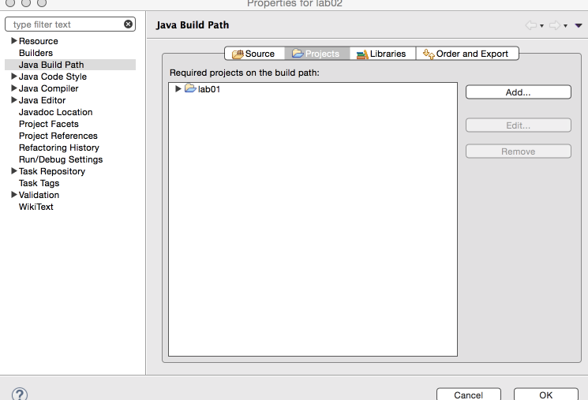

#Sample Program

Create a new project called Lab2.

Put the following sample program into the Lab2 source folder.

~~~
package algorithms;

public class SampleProgram {

  public static void main(String[] args) {
    System.out.println("Starting...");
    HelloWorldInterface hw = new HelloWorld();
    for (int i = 0; i < 1000000; i++) {
      innerLoop(hw, i);
    }

    System.out.println("Finished.");
  }

  public static void innerLoop(HelloWorldInterface hw, int i) {

    for (int j = 0; j < 10000; j++) {
      hw.display();
      System.out.println("i=" + i + ", j=" + j);
      delay();
    }
  }

  // Change the value of the delay loop to speed up or slow things down .
  public static void delay() {
    for (int k = 0; k < 1000; k++)
      ; // this is the empty statement which is covered later
  }
}
~~~

The Sample Program uses the class and interface you created in the previous lab. To include them on your build path, right-click on Lab2 in the Package Explorer and select `Build Path -> Configure Build Path.`

Select the Project tab and add lab01 as shown below. Now your code should compile correctly.(you need to have lab02 complete)

