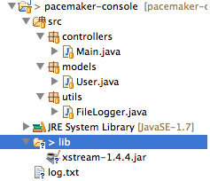
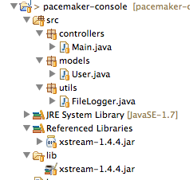
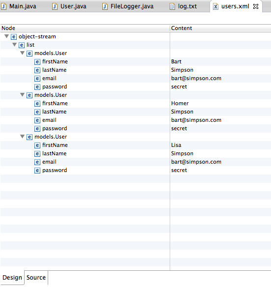
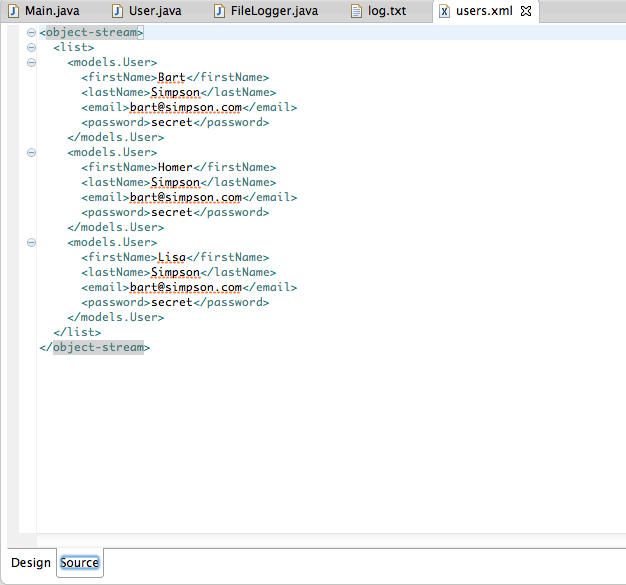

#XStream

Navigate to 

- <http://x-stream.github.io/>

Select 'Download' and, under "Stable Version' download the 'XStream Core only'. This should be a single jar file called 'xstream-x.x.x.jar'

In Eclipse Package Explorer, create a new folder "lib". Do this be selecting the project, select "File->New->Folder". In the offered dialog, enter "lib" as the file name. Drag the xstream.jar file already downloaded into the lib folder: Workspace should look like this

Right click on xstream- and select "Build Path->Add to Build Path". Workspace should now look like this:

Replace the main function (not the entire class Main) with this version here:

~~~java
  public static void main(String[] args) throws IOException
  {
    FileLogger logger = FileLogger.getLogger();
    logger.log("Creating user list");
    
    List<User> users = new ArrayList<User>();
    users.add(new User("Bart", "Simpson", "bart@simpson.com", "secret"));
    users.add(new User("Homer", "Simpson", "bart@simpson.com", "secret"));
    users.add(new User("Lisa", "Simpson", "bart@simpson.com", "secret"));
    System.out.println(users);
    
    logger.log("Serializing contacts to XML");
    XStream xstream = new XStream(new DomDriver());
    ObjectOutputStream out = xstream.createObjectOutputStream(new FileWriter("users.xml"));
    out.writeObject(users);
    out.close();    
    
    logger.log("Finished - shutting down");
  }
~~~

Use the autocorrect feature to correct the package import errors. If used appropriately, the following import statements should be added to the class:

~~~java
import java.io.FileWriter;
import java.io.IOException;
import java.io.ObjectOutputStream;
import java.util.ArrayList;
import java.util.List;

import com.thoughtworks.xstream.XStream;
import com.thoughtworks.xstream.io.xml.DomDriver;

import pim.log.FileLogger;
~~~

Run the program (use steps as before). A file called "users.xml" will have been generated. Using the refresh step from before, make this file visible in package explorer, and open the file.

Two views should be visible. A "Design" view:

and a "Source" view

We have used a component (xstream) to convert an internal data structure into an XML stream, which we have written to a file.

See if you can commit the changes we have just made to git.

