#Git

If you have been committing your project to git during this lab, you should be able to select `Team->Show in History`:

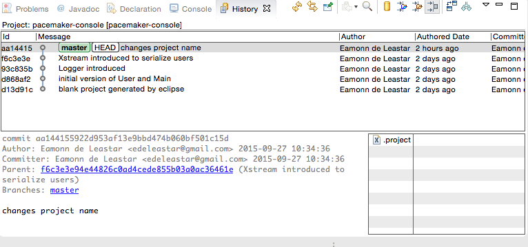

This show each of the commits you have made, including the comments. As yet, this is all taking place locally in your own workstation. We can confirm this be selecting `Team->Show in Repositories View`:

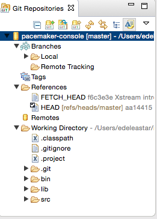

The `Remotes` icon is currently empty.

Now sign up / sign in to github.com and create a new repository. Call it `pacemaker`:

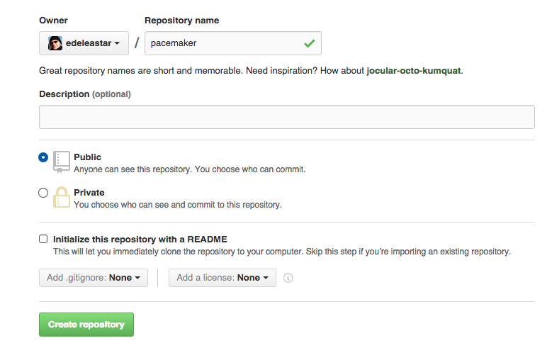

Click 'Create repository'...

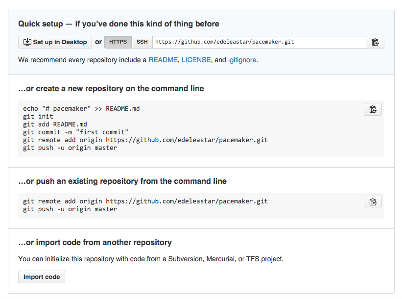

In the above screen, locate the 'Quick Setup' panel and select 'HTTPS', Then select the 'Copy to Clipboard' icon (or manually copy/paste) to get the url into the clipboard.

Back in eclipse, select the `Remotes` icon on the Repository view and right click:

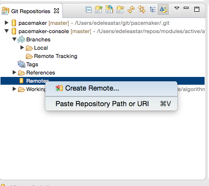

Select 'Create Remote'

... and something like the following will be displayed:

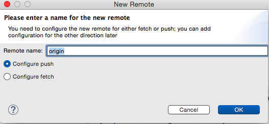

Call the remote 'origin' (which will be the default)

This screen will be next:

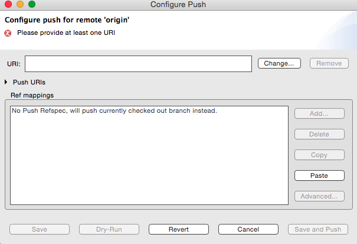

Press the 'Change' button, and you will have an opportunity to past in your url. Some of the fields will be pre-populated, you will have to enter others.

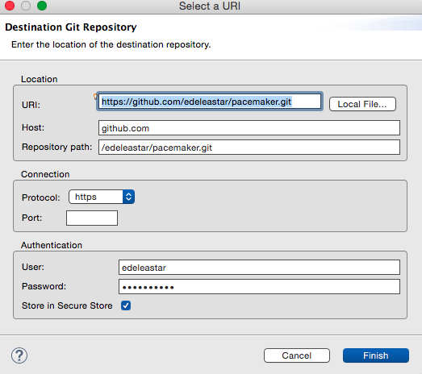

Make sure the username/password is your github credentials. 

Press 'Finish' and on the next screen Press 'Finish & Push' 

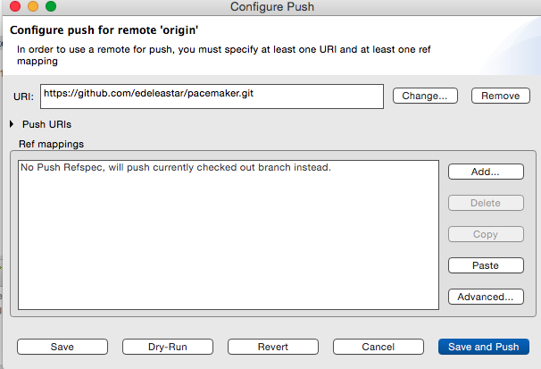

Your repository should be pushed to github.

If all has gone to plan, then the 'Git Repositories' view should reveal the new 'origin':

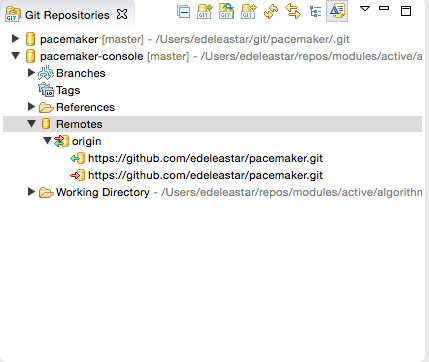

And the repository should be available (publicly) on your gitub repo:

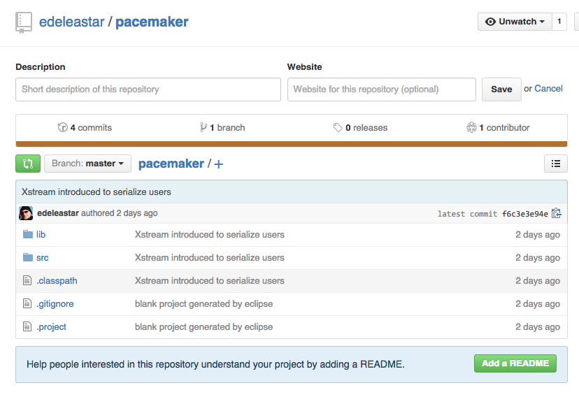

Explore the repo, and verify that the code has been successfully posted.

