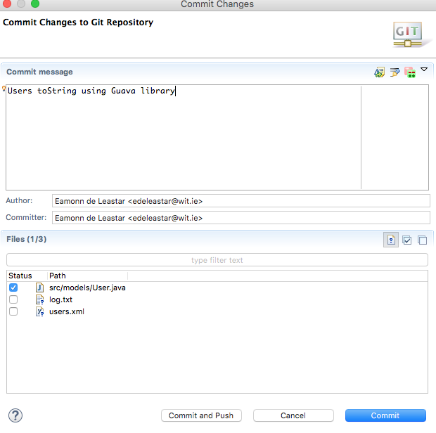

#toString

The console display of the User objects, which appear as some sort of memory address. We can fix this my introducing a 'toString' method into the User class:

~~~java
  public String toString()
  {
    return firstName + ' ' + lastName +' ' +  email +' ' +  password; 
  }
~~~

Run the app again, and verify that you can see the actual user details.

~~~
[Bart Simpson bart@simpson.com secret, Homer Simpson bart@simpson.com secret, Lisa Simpson bart@simpson.com secret]
~~~

The Guava libraries we imported:

- <https://github.com/google/guava>

contains some useful utilities for building toString. Introduce the following import into the top of the User class:

~~~
import static com.google.common.base.MoreObjects.toStringHelper;
~~~

and rewrite toString as follows:

~~~java
  public String toString()
  {
    return toStringHelper(this).addValue(firstName)
                               .addValue(lastName)
                               .addValue(password)
                               .addValue(email)                               
                               .toString();
  }
~~~

The above fragment will require this import:

~~~
import static com.google.common.base.MoreObjects.toStringHelper;
~~~

Run the app again, and note the slightly changed representation of the Users.

~~~
[User{Bart, Simpson, secret, bart@simpson.com}, User{Homer, Simpson, secret, bart@simpson.com}, User{Lisa, Simpson, secret, bart@simpson.com}]
~~~

We should commit this version now before making any more changes. Right click on the project in Package Explore, select Team->Commit - and fill out the form - and the commit:

Then select `Push to upstream` from the Team menu to upload your changes to github. Make that the github repo contains the new additions (by browsing on github to the source code). 

Dont proceed to the next step until you have verified that the git push is operating correctly.

