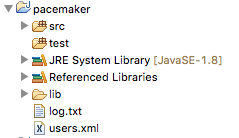

#User Tests

Create a new '`Source Folder` in your project called `test`:

~~~
package models;

import static org.junit.Assert.*;

import java.util.HashSet;
import java.util.Set;
import org.junit.Test;

import static models.Fixtures.users;

public class UserTest
{
  User homer = new User ("homer", "simpson", "homer@simpson.com",  "secret");
  
  @Test
  public void testCreate()
  {
    assertEquals ("homer",               homer.firstName);
    assertEquals ("simpson",             homer.lastName);
    assertEquals ("homer@simpson.com",   homer.email);   
    assertEquals ("secret",              homer.password);   
  }
  
  @Test
  public void testIds()
  {
    Set<Long> ids = new HashSet<>();
    for (User user : users)
    {
      ids.add(user.id);
    }
    assertEquals (users.length, ids.size());
  }
  
  @Test
  public void testToString()
  {
    assertEquals ("User{" + homer.id + ", homer, simpson, secret, homer@simpson.com}", homer.toString());
  }
}
~~~

When you bring in this class, it will not compile due to missing libraries. Figure out how to add these now one way or another. Eclipse might prompt with this auto-fixup dialog:

It will still not compile - as we are missing the fixtures:

~~~
package models;

public class Fixtures
{
  public static User[] users =
  {
    new User ("marge", "simpson", "marge@simpson.com",  "secret"),
    new User ("lisa",  "simpson", "lisa@simpson.com",   "secret"),
    new User ("bart",  "simpson", "bart@simpson.com",   "secret"),
    new User ("maggie","simpson", "maggie@simpson.com", "secret")
  };
}
~~~

The tests should run now - but one of them is failing. Can you fix it?

