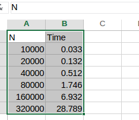
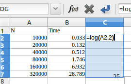
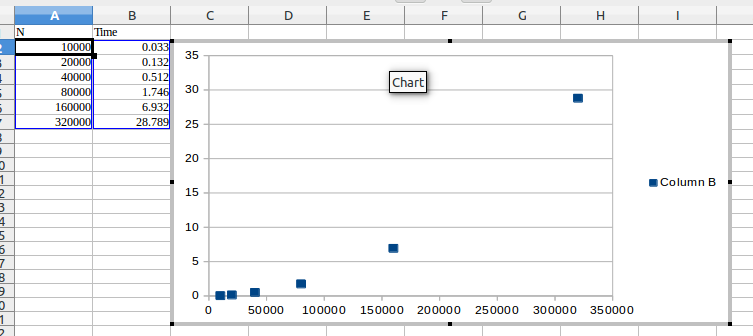
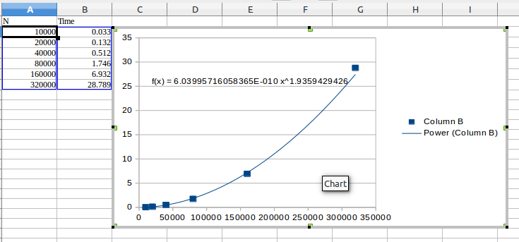

##Make Some Observations

Now run the program for different size inputs. It's a good idea to plan your experiment. start with a size of 10,000 and double the input size for each subsequent run.  Complete the following table with the running times. 

| N        | Time (seconds) |
| ------------- |:-------------:| 
| 10000    | ? | 
| 20000      | ?    | 
| 40000 | ?   |
| 80000 | ?   |
| 160000 | ?   |
| 320000 | ?   |

##Analyse the data
For this part you may want to use a spreadsheet application. Enter your recorded data into a spreadsheet  and use the charting tool to plot the result. 
The following are instructions for MS Excel:
- Enter your data in a new blank spreadsheet
 
- Now get the log values of the data. In the cell enter the following formula ``=log(A1, 2)`` where the first argument  is the cell containing to the 1st input size value (N) and the second argument is the base (i.e. base 2)
 
- You can use the charting tool to "fit" an equation to the data. Select the data an click Insert->Scatter Chart
 
- Select/click on the data points and right cligk to bring up a menu. Select "inset Tr4end line. We want to use the Power law so select power as the regression/line type. Also, select "show equation". You may need to look up the help option in the spreadsheet appication you're using. You should end up with something resembling the  following:
 
- You can now use the equation as the basis for your hypothesis for predicting running time of you algorithm. remember the power depends on the algorithm, the coefficient depends on the hardware, software etc. of the machine. 

####
###Hypothesis
Using the equation from the last section, predict the running time for an array of size 50,000. Then, run an experiment using your program to validate if your hypothesis is correct. It wont be exactly the same but should be close if your hypothesis is correct.

##Birthday Problem

How likely is it that, in a group of people, at least 2 of them have the same birthday? Write a program that takes an integer N from the command line and generates a random sequence of integers between 0 and N – 1. Run experiments to validate the hypothesis that the number of integers generated before the first repeated value is found is $$sqrt(pi N/2)$$