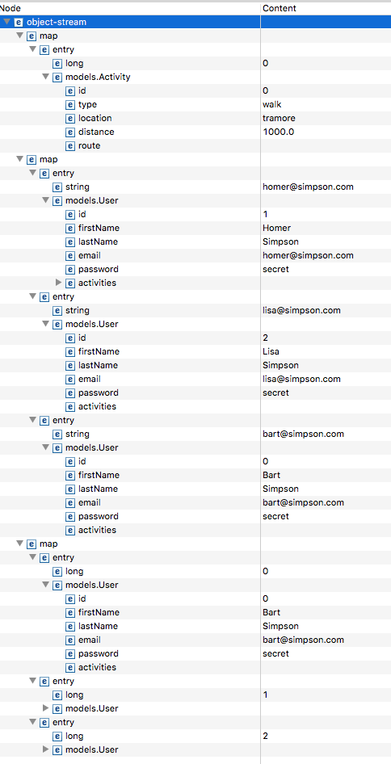
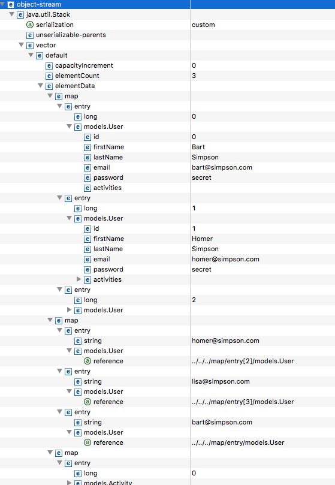

##Object References and Serialization

The problem with our current serializer is that the three Maps serialized are completely independent - even though the maps in memory prior to serialization contain shared objects. This is apparent from this structural view here:

Correcting this is relatively straightforward. Object referential context is only preserved over a single writeObject operation - we have been doing several on our serializer - see the relevant fragments of the read and write methods:

###write
~~~java
      while (!stack.empty())
      {
        os.writeObject(stack.pop());  
      }
~~~

###read
~~~java
      Object obj = is.readObject();
      while (obj != null)
      {
        stack.push(obj);
        obj = is.readObject();
      }
~~~

Replace the above fragments with single read/write operation:

###write
~~~java
      os.writeObject(stack);
~~~

###read
~~~java
      stack = (Stack) is.readObject();
~~~

To test this, change `main` to use a different file:

~~~
    File  datastore = new File("datastore3.xml");
~~~

When you run main, it produces a different serialization structure - with objects shared via references. You can see this more easily from the structural view:

Also explore the xml aspects - can you see the difference form `datastore2.xml` - which should still be your project?
